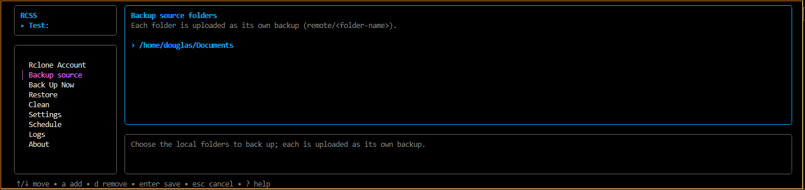

# RCSS-tui



RCSS-tui is a terminal backup manager powered by [`rclone`](https://rclone.org).
It provides a friendly terminal UI for backup, restore, cleanup, and scheduling,
plus headless commands for automation.

It runs on Linux, macOS, and Windows and supports multiple isolated accounts—one
for each rclone remote. RCSS never handles your cloud credentials; they remain
in rclone's configuration.

## How it works

Choose one or more local folders and an rclone remote. Each folder is uploaded
as a separate backup using its folder name:

```text
/home/me/Documents  ──►  drive:Backups/Documents
/home/me/Projects   ──►  drive:Backups/Projects
```

Uploads are one-way. Local files are kept by default, and optional local cleanup
only runs after a successful upload.

## Requirements

- [`rclone`](https://rclone.org/downloads/) installed and available on `PATH`
- at least one configured rclone remote
- a terminal of at least **80×14** for the UI

Check rclone and create a remote:

```bash
rclone version
rclone config
```

A remote named `drive` appears in RCSS as `drive:`. You can also open rclone's
setup from the **Rclone Account** screen.

## Install

```bash
git clone https://github.com/dougmb/RCSS-tui.git
cd RCSS-tui
go build -o rcss .
./rcss
```

Move the binary to a directory on your `PATH` if you want to run `rcss` from
anywhere.

## Quick start

1. Run `rcss`.
2. Open **Rclone Account** and select a remote.
3. Open **Backup source**. Press `a` to add each folder, then `enter` to save.
4. Optionally use **Settings** to set a remote destination, exclusions, and
   retention rules.
5. Open **Back Up Now**, confirm the destination, and press `enter`.
6. Optionally use **Schedule** to automate uploads and cloud cleanup.

If rclone is missing, the UI still opens, but cloud operations remain locked.

## Main screens

| Screen | Purpose |
| --- | --- |
| **Rclone Account** | Add, select, switch, or forget an account |
| **Backup source** | Manage the local folders backed up by the active account |
| **Back Up Now** | Upload all source folders with live progress |
| **Restore** | Browse remote backups and restore a file or folder |
| **Clean** | Preview, select, and delete expired cloud backups |
| **Settings** | Configure destinations, retention, exclusions, and local cleanup |
| **Schedule** | Schedule Upload and Clean through the operating system |
| **Logs** | View the active account's backup log |
| **About** | View version, dependency status, and config locations |

Common keys:

| Key | Action |
| --- | --- |
| `↑` / `↓` or `j` / `k` | Move |
| `enter` or `→` | Select or open |
| `esc` | Go back |
| `1`–`9` | Jump to a screen |
| `/` | Filter a list |
| `?` | Show keyboard help |
| `q` or `ctrl+c` | Quit |

The footer shows the keys available on the current screen.

## Accounts

Each account maps to one rclone remote and has its own folders, destinations,
retention rules, exclusions, log, and scheduled jobs. Forgetting an account
removes only its RCSS settings—it does not delete the rclone remote or cloud
data. Remote names include the trailing colon, such as `drive:`.

## Backup and restore

**Back Up Now** uploads every configured source folder to:

```text
<remote>/<remote destination>/<source folder name>/
```

A blank remote destination means the remote root. The destination from
**Settings** can be changed for one run before the upload starts.

**Restore** lets you browse backups, choose a file or folder, and confirm the
local destination. Restore output is shown in the terminal and is not appended
to the backup log.

## Cleanup and safety

Local and cloud cleanup are separate operations.

Local cleanup is disabled by default. When enabled, it runs only after that
source uploads successfully. Failed uploads and excluded files never trigger
local deletion. A `retention_days` value of `0` removes uploaded local files
immediately after success.

**Clean** finds cloud files older than `remote_retention_days`. The UI first
creates a dry-run preview so you can review and select candidates.

Cleanup is blocked unless the remote has a backup newer than
`remote_cleanup_safety_days`. Force mode bypasses this lock and requires an
additional typed confirmation in the UI.

## Scheduling

Upload and Clean can run daily or weekly at a selected time. On Linux and macOS,
RCSS changes only its `# >>> RCSS-managed >>>` to `# <<< RCSS-managed <<<`
crontab block. On Windows, it owns tasks named `RCSS-<account>-Upload` and
`RCSS-<account>-Clean`. Other scheduled entries are preserved.

## Headless CLI

```bash
rcss upload [-v] [-p] [--account NAME]
rcss clean  [-v] [--dry-run] [--force] [--account NAME]
rcss help
```

| Option | Meaning |
| --- | --- |
| `-v` | Show verbose output |
| `-p` | Show rclone transfer progress during upload |
| `--dry-run` | Preview cloud cleanup without deleting files |
| `--force` | Bypass the cloud cleanup safety lock |
| `--account NAME` | Use a remote such as `drive:` instead of the active account |

Examples:

```bash
rcss upload -p
rcss upload --account "work:"
rcss clean --dry-run --account "drive:"
```

## Configuration

Settings are stored in `~/.config/rcss/config.toml`; `XDG_CONFIG_HOME` is
respected. The file contains no cloud credentials.

| Field | Default | Meaning |
| --- | --- | --- |
| `remote_name` | — | rclone remote and account key |
| `source_folders` | `[]` | local folders uploaded as separate backups |
| `remote_destination` | blank | remote folder; blank means the remote root |
| `restore_destination` | blank | restore folder; blank uses the matching source |
| `delete_after_upload` | `false` | enable local cleanup after successful uploads |
| `retention_days` | `0` | local retention when cleanup is enabled |
| `remote_retention_days` | `15` | age at which cloud files become cleanup candidates |
| `remote_cleanup_safety_days` | `2` | required recency of the newest remote backup |
| `skip_formats` | `[]` | exclusions such as `*.log` or `node_modules/**` |
| `ignored_folders` | `[]` | directory names excluded inside each source |
| `log_file` | per-account file | append-only backup log |

Older single-account configurations are migrated automatically.

## Encrypted backups

RCSS supports rclone's [`crypt`](https://rclone.org/crypt/) backend. Create a
crypt remote with `rclone config`, then select it in RCSS. Keep its password
safe—encrypted backups cannot be recovered without it.

## Development

```bash
go build ./...
go vet ./...
go test -race ./...
```

```text
main.go      TUI and headless CLI entrypoint
config/      account configuration and persistence
rclone/      rclone command wrapper
backup/      upload, restore, cleanup, and logging
scheduler/   crontab and Windows Task Scheduler integration
tui/         Bubble Tea screens and styles
```

RCSS-tui is the Go successor to the original Bash-based
[`dougmb/RCSS`](https://github.com/dougmb/RCSS) project.

## License

[MIT](LICENSE)
